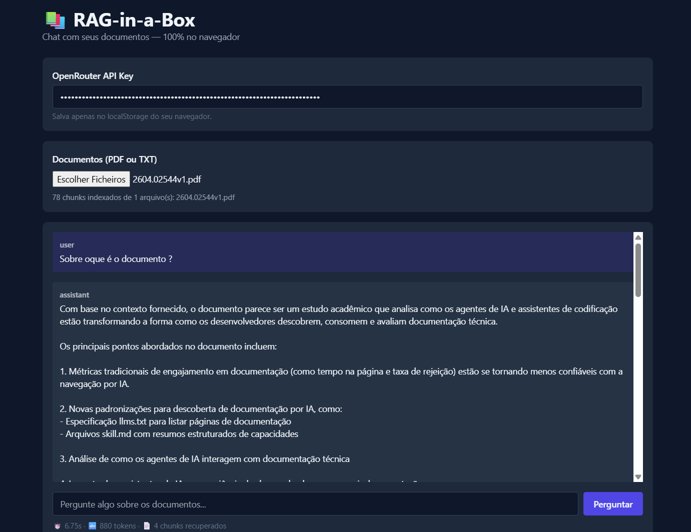
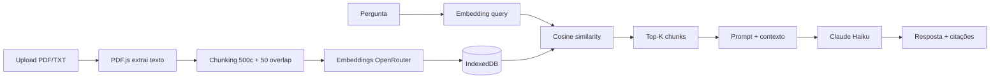

# 📚 RAG-in-a-Box

> Chat com seus documentos — 100% no navegador, zero backend.

Um sistema completo de **Retrieval-Augmented Generation (RAG)** rodando inteiramente client-side: extração de PDF, chunking, embeddings, vector store e geração com citações. Tudo em um único arquivo HTML.

<!-- 🔗 **[Demo ao vivo](https://SEU-USUARIO.github.io/rag-in-a-box/)** · 🎥 **[Vídeo de 90s](https://loom.com/seu-link)** -->



---

## ✨ O que faz

- 📄 Upload de **PDF** ou **TXT** (múltiplos arquivos)
- ✂️ **Chunking** com sliding window e overlap configurável
- 🧠 **Embeddings** via OpenRouter (`text-embedding-3-small`)
- 💾 **Vector store** persistente em IndexedDB
- 🔍 **Busca semântica** com cosine similarity
- 💬 Respostas com **citações inline** `[1]`, `[2]` e chunks-fonte expansíveis
- 📊 Métricas em tempo real: latência, tokens, chunks recuperados

---

## 🏗️ Arquitetura



### Stack
| Camada | Tecnologia | Justificativa |
|---|---|---|
| UI | HTML + Tailwind CDN | Zero build, foco no que importa |
| Extração PDF | PDF.js | Padrão de mercado, roda no browser |
| Vector store | IndexedDB | Suporta MB+ (vs ~5MB do localStorage) |
| Embeddings | `openai/text-embedding-3-small` | $0.02/1M tokens, 1536 dims |
| LLM | `anthropic/claude-3.5-haiku` | Equilíbrio custo/qualidade |
| Roteamento | OpenRouter | Troca de modelo em 1 linha |

---

## 🎯 Decisões arquiteturais e trade-offs

Esta seção é o que diferencia este projeto de um "tutorial de RAG". Cada escolha tem custo e benefício explícitos.

### 1. Por que client-side puro?
**Decisão:** rodar 100% no browser, sem servidor.

**Prós:**
- Zero custo de infra
- Privacidade: documentos nunca saem do dispositivo do usuário
- Deploy trivial (GitHub Pages, Vercel static, etc.)

**Contras (assumidos):**
- API key do OpenRouter fica exposta no client
- Cosine similarity em JS não escala >10k chunks
- Sem multi-usuário ou sincronização

**Mitigação para produção real:** mover chamadas OpenRouter para um proxy backend (ex: Cloudflare Worker) que injeta a key. Mantém o resto da arquitetura client-side.

### 2. Chunking por caracteres, não por tokens
**Decisão:** sliding window de 500 caracteres com 50 de overlap.

**Trade-off:** chunking por tokens (via `tiktoken`) seria mais preciso para respeitar limites do modelo, mas exigiria carregar uma lib de ~2MB. Para documentos típicos (papers, manuais), 500 chars ≈ 100-150 tokens — bem dentro de qualquer janela de contexto.

**Próximo nível:** chunking semântico (por parágrafo/seção) ou recursive character splitting estilo LangChain.

### 3. Cosine similarity em JS puro
**Decisão:** loop O(n) sobre todos os chunks a cada query.

**Justificativa:** para <10k chunks roda em <50ms. HNSW/FAISS no browser (via WASM) seria over-engineering para o caso de uso.

**Quando trocar:** acima de 50k chunks, migrar para [hnswlib-wasm](https://github.com/ChrisGuy/hnswlib-wasm) ou backend com pgvector/Qdrant.

### 4. Top-K = 4 chunks
**Decisão:** recuperar 4 chunks por query.

**Raciocínio:** k=1 perde contexto; k=10 polui prompt e aumenta custo/latência. K=4 é o sweet spot empírico para chunks de ~500 chars com modelos de janela 200k+.

### 5. Sem re-ranking
**Decisão consciente:** não implementado nesta versão.

**Por quê não:** adiciona uma chamada LLM extra (latência + custo) com ganho marginal em corpora pequenos.

**Quando vale:** corpora >1k chunks ou queries ambíguas. Implementação ideal: recuperar top-20 por embedding, re-rankear com cross-encoder ou LLM.

### 6. Apaga índice a cada upload
**Decisão:** simplificação intencional.

**Limitação reconhecida:** não suporta crescimento incremental de corpus. Trivial de remover (basta não chamar `clearChunks()`), mas mantém demo previsível.

---

## ⚠️ Considerações de segurança

A API key do OpenRouter é armazenada no `localStorage` e enviada do browser. Isso é **aceitável para demo/portfólio** com uma key de baixo limite ($1-2), mas **inadequado para produção**.

**Para produção, recomendo:**
1. Backend proxy (Cloudflare Worker, Vercel Function) que injeta a key
2. Rate limiting por IP/sessão
3. Validação de tamanho de upload e tipos de arquivo
4. Sanitização de conteúdo extraído antes de enviar ao LLM (prompt injection)

---

## 📊 Métricas observadas (benchmark informal)

Testado com paper de 12 páginas (~25k caracteres):

| Métrica | Valor |
|---|---|
| Tempo de indexação | ~8s |
| Chunks gerados | 56 |
| Tamanho do índice (IndexedDB) | ~700 KB |
| Latência média de resposta | 1.8s |
| Tokens por query (média) | ~2.500 |
| Custo por query | ~$0.0008 |

---

## 🚀 Como rodar

### Localmente
```bash
git clone https://github.com/SEU-USUARIO/rag-in-a-box
cd rag-in-a-box
# qualquer servidor estático serve
python -m http.server 8000
# abrir http://localhost:8000
```

### Configurar
1. Crie uma conta em [openrouter.ai](https://openrouter.ai)
2. Gere uma API key e deposite ~$1
3. Cole a key no campo do app (fica salva em localStorage local)
4. Faça upload de um PDF/TXT
5. Pergunte

---

## 🛣️ Roadmap

- [ ] **Streaming** de resposta via Server-Sent Events
- [ ] **Hybrid search**: BM25 + embeddings com fusão RRF
- [ ] **Re-ranking** dos top-20 com LLM judge
- [ ] **Highlight** do trecho exato que gerou cada citação
- [ ] **Eval harness**: dataset de QA com golden answers + métricas (faithfulness, relevance)
- [ ] **Suporte multi-documento incremental** (sem apagar índice)
- [ ] **Chunking semântico** por parágrafo/seção
- [ ] **Compressão de embeddings** (quantização int8) para corpora maiores

---

## 📚 Referências

- [Lewis et al. — RAG: Retrieval-Augmented Generation (2020)](https://arxiv.org/abs/2005.11401)
- [Anthropic — Contextual Retrieval](https://www.anthropic.com/news/contextual-retrieval)
- [OpenRouter Docs](https://openrouter.ai/docs)
- [PDF.js](https://mozilla.github.io/pdf.js/)

---

## 📄 Licença

MIT — use, modifique, aprenda.

---

**Feito por [Diogo](https://www.linkedin.com/in/diogovdcpa/)** — **Applied AI Engineer**.
